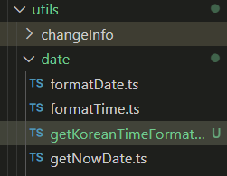
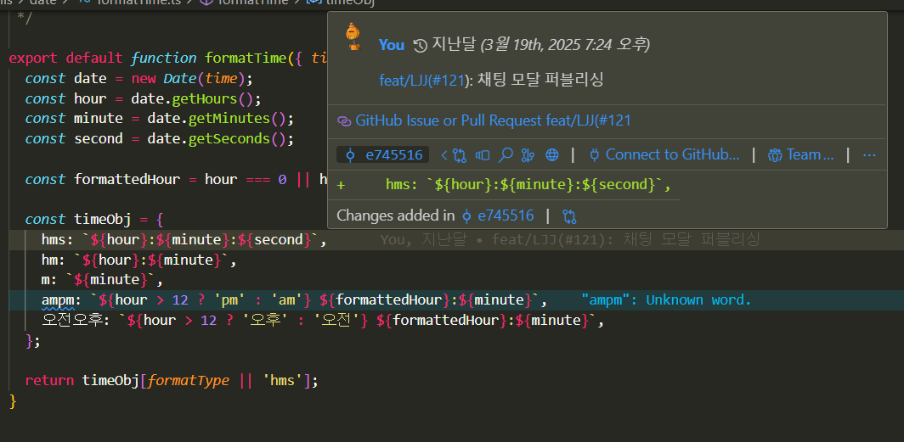
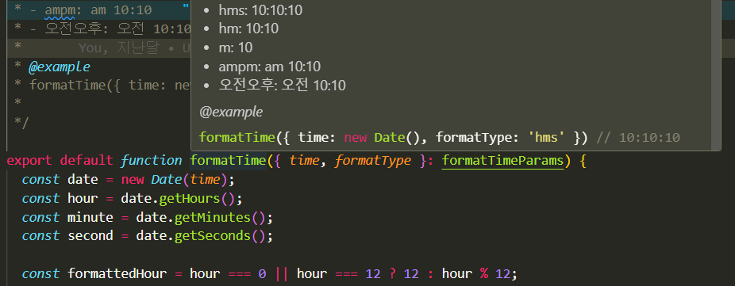

# 감상평

4장은 주석에 대해 글쓴이의 생각을 전달합니다. 4장 마지막 부분에 적어놓긴 했지만, 주석은 상황에 따라서 사용할 수 있습니다. 중요한 점은 이 주석이 올바른지 아닌지를 판단하는 능력이라고 생각합니다.

# 주석

- 잘 달린 주석은 그 어떤 정보보다 유용하지만, 경솔하고 근거 없는 주석은 코드를 이해하기 어렵게 만든다. 또한 오래되고 조잡한 주석은 거짓과 잘못된 정보를 퍼뜨린다고 말한다.

글쓴이는, 주석을 통해서 정보를 전달하는데 드는 힘을, 주석 없이도 이해할 수 있는 방향으로 노력하라고 말한다.
부정확한 주석은 아예 없는 주석보다 훨씬 더 나쁘다고 이야기 한다. 이러한 주석은 오히려 독자를 현혹하고 오도한다고 이야기 한다.

## 주석은 나쁜 코드를 보완하지 못한다

코드에 주석을 추가하는 일반적인 이유는 코드 품질이 나쁘기 때문이다. 내가 짠 코드가 지저분한 코드란 것을 인지하면, 이 것을 다른 사람이 보기에 적절해 보이도록 주석을 단다고 말한다. 하지만 주석을 다는게 아니라 코드를 정리해야 한다.

## 코드로 의도를 표현하라!

```java
//직원에게 복지 해택을 받을 자격이 있는지 검사한다.
if ((employee.flags && HOURLY_FLAG) && (employee.age > 65)) {}
```

```java
if (employee.isEligibleForFullBenefits) {}
```

위 두 코드를 비교했을 때, 물론 주석이 있는코드가 단번에 이해하기 편할 수 있지만, 밑의 코드처럼 충분히 조금만 생각해도 의미를 표현할 수 있다.

> 저도 예전같았으면, 위의 코드가 좀 더 의미가 명확하고 편하다는것을 알지만, 이제와서 생각해보면, 코드가 변화하는 것에 맞춰서 결국 주석의 문구도 변화를 주어야 하고, 코드가 더러워지더라도, 주석 하나로 설명이 가능하기 때문에 코드의 발전 측면에서 있을 때, 밑의 코드가 더 좋을 것 같다는 생각을 했습니다.

## 좋은 주석

> 좋은 주석은 주석을 달지 않을 방법을 찾아낸 주석이라는 사실

### 법적인 주석

법적인 이유로 특정 주석이 필요한 경우가 있다.

// Copyright (C) 2025, by Modern-Agile
// MIT License

- 모든 조항과 조건을 열거하는 대신에, 가능하다면, 표준 라이선스나 외부 문서를 참조할 수 있다.

### 정보를 제공하는 주석

- 때로는 기본적인 정보를 주석으로 제공하면 편리하다.

```java
//테스트 중인 REsponder 인스턴스를 반환한다.
protected abstract Responder responderInstance();
```

위와 같이 주석을 활용해서 정보를 전달하는 것은 유용하다.
하지만 `responderBeingTested`로 이름을 바꿀 수 있다.

```java
//kk:mm:ss EEE, MMM dd, yyyy 형식이다.
Pattern timeMatcher = Pattern.compile("\\d*:\\d*\\d* \\w* \\d*, \\d*");
```

위와 같은 코드에서는 정규표현식이 시각과 날짜를 뜻한다고 설명하고 있다.
하지만 이 마저도, 날짜를 변환하는 클래스를 만들어 코드를 옮겨주면 더 좋고 깔끔하다. 주석도 필요없어진다.

> 저도 코드를 짜면서 이런식으로 주석을 종종 달게되는데, 날짜 관련한 예시를 들어보자면,

```ts
interface formatTimeParams {
  time: Date | string | number;
  formatType?:
    | "hms" //10:10:10
    | "hm" //10:10
    | "m" //10
    | "ampm" //am 10:10
    | "오전오후"; //오전 10:10
}

/**
 *
 * @param time 시간 입력 string | number | Date
 * @param formatType 시간 포맷 타입
 *
 * @returns
 * - hms: 10:10:10
 * - hm: 10:10
 * - m: 10
 * - ampm: am 10:10
 * - 오전오후: 오전 10:10
 *
 */

export default function formatTime({ time, formatType }: formatTimeParams) {
  const date = new Date(time);
  const hour = date.getHours();
  const minute = date.getMinutes();
  const second = date.getSeconds();

  const formattedHour = hour === 0 || hour === 12 ? 12 : hour % 12;

  const timeObj = {
    hms: `${hour}:${minute}:${second}`,
    hm: `${hour}:${minute}`,
    m: `${minute}`,
    ampm: `${hour > 12 ? "pm" : "am"} ${formattedHour}:${minute}`,
    오전오후: `${hour > 12 ? "오후" : "오전"} ${formattedHour}:${minute}`,
  };

  return timeObj[formatType || "hms"];
}
```

위 코드는 제가 실제로 작성했던 시간을 formatting하는 코드인데, 여기서 반환할 때, 어떤한 형식으로 반환할 지에 대한 정보를 인자값으로 받습니다. 해당 코드는 `utils > date`하위에 존재하는 함수입니다. 위 글에서 설명한 것 처럼, 저는 주석을 달아놓긴 했지만, 불러와서 사용할 때, `date.formatTime("24:10:10", "오전오후")` 이런식으로 불러와서 사용합니다. date내부에 들어있는 함수 이기 때문에 date를 제공하는 함수라는 주석을 필요없겠지만, 반환하는 타입 때문에 주석이 있으면 좋을 것 같다는 생각을 했습니다.

그리고 이 글을 보고, 그 생각이 조금 더 명확해 졌습니다. 지금 처럼 반환하는 형식이 제각각 이거나, 인수를 통해서 반환값이 변화하는 함수라면 주석이 어느정도는 필요하지만, 그게 아니라 단 하나의 값만 반환하는 함수라면, 제가 `date`라는 폴더에 담아서 호출 한 것 처럼 그 포맷 타입을 하나의 함수로 만들어서 호춯하는게 주석을 사용하지 않고 인수값도 덜 넘기기 때문에, 전 장에서 배웠던 함수에 내용과 주석의 내용을 모두 잡을 수 있는 것 같습니다.



### 의도를 설명하는 주석

```java
 public int compareTo(Object o) {
     if(o instanceof WikiPagePath) {
        WikiPagePath p = (WikiPagePath) o;
        String comp res sedName = St ringUt il. j oin (names r ,,H);
        String comp res sedA rg umentName = St ringUt il.j oin(p.names, ,H,);
        return compressedName.compa reTo(comp ressedArgumentName);
    }
    return 1; // 오른쪽 유형이므로 정렬 순위가 더 높다.
}
```

해당 문제의 해결방식에 동의하든 말든의 상관없이, 어쨌는 저자의 의도가 드러난다.

### 의미를 명료하게 밝히는 주석

- 인수나, 반환값 자체를 명확하게 만들면 더 좋겠지만, 그렇지 못한 상황에서는 주석으로 의미를 밝히는게 유용하다.

의미를 명료하게 밝히는 주석은 좋은 주석인 동시에 위험하기도 하다, 그릇된 정보를 담게되면, 독자가 읽을 때 혼란을 야기할 수 있다.

> 해당 내용은 제가 위에서 설명한 시간포맷 함수에 대해서 설명을 참고하면 될 것 같습니다.

### 결과를 경고하는 주석

```java
 public static SimpleDateFormat makeStandardHttpDateFormat()
{
    // SimpieDateFomat은 스레드에 안전하지 못하다.
    // 따라서 각 인스턴스를 독립적으로 생성해야 한다.
    SimpleDateFormat df = new SimpleDateFomat("EEE, dd MMM yyyy HH:mm:ss z"
    df.setTimeZone(TimeZone.getTimeZone(11 GMT''));
    return df;
}
```

해당 코드에서 주석은 합리적이다. 프로그램 효율을 높이기 위해서 정적 초기화 함수를 사용하려던 사용자에 대해서 주석이 막아주었기 때문이다.

> 저는 java의 동작 방식도 잘 모르고, 정적 초기화를 통해서 어떤식으로 효율적이게 되는지도 잘 모릅니다. 여기서 이야기 하고자 아는 것은, 해당 함수를 실행했을 때, 혹은 사용했을 때, 어떤식으로 작성하면, 오류가 발생할 가능성이 있는지에 대한 `경고`를 목적으로 합니다.

### TODO 주석

- 앞으로 해야할 일을 주석으로 남겨주면 편리하다.

```java
// TODO-MdM 현재 필요하지 않다.
 // 체크아웃 모델을 도입하면 함수가 필요 없다.
 protected Versioninfo makeVersion() throws Exception
{
 return null;
}
```

TODO 주석

- 당장 구현하기 어려운 문제를 기술
- 더 이상 필요없는 기능 삭제
- 누군가에게 문제를 봐달라는 요청
- 더 좋은 이름을 떠올려달라는 부탁
- 앞으로 발생할 이벤트에 맞춰 코드를 고치라는 주의

> vscode에서도 todo관련한 확장기능들이 존재합니다. 해당 기능들을 잘 활용하면, 코드를 작성할 때, 효율적으로 작성이 가능할 것 같다고 생각했습니다.

> 저는 보통 위에서 이야기해준 Todo주석을 PR을 올리면서 리뷰어에게 "~~이런 부분은 --- 를 주의해서 봐주세요" 처럼, 코멘트를 남기곤 했느데, 이 글을 보고, Todo를 주석으로 남겨 놓은 것 또한 좋은 방법인 것 같다는 생각을 했습니다.

### 중요성을 강조하는 주석

- 대수롭지 않다고 여겨질 뭔가의 중요성을 강조하기 위해서 주석을 사용한다.

### 공개 API에서 JavaDocs

- 설명이 잘 된 공개 API는 유용하고 만족스럽다.
  JavaDocs를 잘 활용한 코드는 사용하기 편하고, 프로그램을 짤 때 큰 도움을 준다.

주의해야할 점은, JavaDocs도 위에서 계속 언급했던 주석에 대한 주의사항을 지키지 않는다면, 그릇된 정보를 전달할 가능성이 존재한다.

> javascript에서도 jsDocs가 존재하는데, 이는 JavaDocs와 완벽하게 유사합니다. 위에서 한 번 언급했던 `formatTime`함수에 대해서도 `jsDocs`가 적용되어 있습니다.

> 위 함수를 만들 때, `jsDocs`를 사용한 이유는, 전역적으로 사용될 가능성이 있는 함수였기 때문입니다.

## 나쁜 주석

- 대다수의 주석이 해당 범주에 속한다.

### 주절거리는 주석

- 주석의 답을 알아내기 위해서 다른 코드를 뒤져보는 주석은 독자와 제대로 소통하지 못하는 주석이다.

### 같은 이야기를 중복하는 주석

- 코드를 정당화 하지 못하는 주석
- 의도나 근거를 설명하지 못하는 주석
- 코드보다 읽기 어려운 주석
- 코드보다 부정확한 주석

위 내용은 독자가 함수를 대충 이해하고 넘어가게 만든다.
이는 후드를 열어볼 필요가 없다고 가스라이팅하는 중고차 판매원과 비슷하다.

또 한 너무 많은 JavaDocs나 주석은 코드만 지저분하게 만든다.

### 오해할 여지가 있는 주석

```java
 // this.closed가 true일 때 반환되는 유틸리티 메서드다.
 // 타임아웃에 도달하면 예외를 던진다.
 public synchronized void waitForClose(final long timeoutMillis)
 throws Exception
 {
 if(!closed)
 {
 wait(timeoutMillis);
 if(!closed)
 throw new Exception("MockResponseSender could not be closed");
 }
 }
```

위 코드에서

- this.closed가 true로 변하는 순간에 메서드는 반환되지 않는다.
- this.closed가 true여야 메서드가 반환된다.
- 무조건 timeout을 기다렸다 this.closed가 그래도 true가 아니면 예외를 던진다

처럼 어려가지 의미로 해석될 여지가 있다.

> 여기서 의미하는 바는, 주석을 통해서 의미를 전달할 때에는 여러가지 의미가 중복되게 주석을 달면 안된다

### 의무적으로 다는 주석

- 의무적으로 달아야한다는 규칙은 오히려 코드를 복잡하게 만들거나, 혼동과 무질서를 초래시킨다.

```java
/ **
 *
 * @param title CD 제목
* @param author CD 저자
* @param tracks CD 트랙 숫자
* @param durationlnMinutes CD 길이(단위: 분)
 '이
public void addCD(String title, String author,
int tracks, int durationlnMinutes) {
 CD cd = new CD();
 cd.title = title;
 cd.author = author;
 cd.tracks = tracks;
 cd.duration = du rationlnMinutes;
 cdList.add(cd);
 }
```

> 책에서는 위 와 같은 코드를 제공하면서, 이 코드가 모든 함수에 주석을 넣으라 했을 때 만들어진 끔찍한 결과물이라 설명합니다. 이전의 제가 봤을 때는 아무 문제 없는거 아니야? 라고 생각했겠지만, 앞선 3장을 본 제가 든 생각은, 이미 인자의 값이 명확하게 의미하는 바가 있는데, 제목, 저자, 트랙 숫자 라는 의미없는 주석으로 인해서, 한 번 더 생각하게 만들거나, 독자가 사용할 때, 생각한 동작으로 움직이지 않을 가능성이 있음을 이야기 하는 것 같습니다.

### 이력을 기록하는 주석

- 예전의 코드에서는 버전관리 시스템이 뚜렷하지 않았기 때문에, 코드의 기록을 주석으로 남겨놓았다. 하지만 이제는 혼란만 가중시킬 뿐 이다. 제거하자

> 해당 부분을 보고 vscode와 github를 연동시 사용할 수 있는 기능이 생각났습니다.



글쓴이가 더 이상 필요 없다고 이야기 한 것은, 버전관리 시스템의 발전도 있지만, 이런식의 부가적인 기능들의 발전을 통해서 굳이 주석으로 달아놓지 않아도, 누가 코드를 최근에 작성했고, 어떤식으로 변경했는지에 대한 작은 코멘트를 확인할 수 있기 때문이 아닌가 싶습니다.

### 있으나 마나 한 주석

- 새로운 정보를 제공하지 못하는 주석
- 중복된 정보의 주석
- 너무 당연한 사실을 이야기 하는 주석

있으나 마나한 주석을 달 시간에, 해당 코드를 개선하는 방향이 조금더 행복한 프로그래머가 되는 길이다.

### 무서운 잡음

- 때로는 JavaDocs로 잡음이다. 오픈 소스 라이브러리에서 가져온 코드를 봤을 때, 아무 의미도 없는 주석이 있는 모습이다. 단지 문서를 제공해야 한다는 잘못된 욕심으로 생긴 잡음이다.

> modern-kit 라이브러리에 기여를 하면서 생각한 부분인데, 잘못된 정보를 작성했을 때, 모든 사람이 보고 사용할 수 있는 오픈소스는 치명적인 오류로 다가올 수 있다는 생각이 들었습니다. 그래서 다른 사람들이 작성한 주석을 참고하기도 하고, PR코멘트를 통해서 첨삭을 받기도 했습니다.

> 제가 이야기 한 부분을 생각해 봤을 때, 주석이 하는 역할은 무궁무진하지만, 그 만큼 위험도 따르는 것 같습니다. 상황에 따라서 써야하고 쓰지 말아야 부분을 스스로 생각해야 한다는게 참 어려운 것 같습니다.

### 함수나 변수로 표현할 수 있다면 주석을 달지 마라

```java
 // 전역 목록 <smodule>에 속하는 모듈이 우리가 속한 하위 시스템에 의존하는가?
 if (smodule.getDependSubsystems().contains(subSysMod.getSubSystem()))
```

```java
 ArrayList moduleDependees = smodule.getDependSubsystems();
 String ourSubSystem = subSysMod.getSubSystem();
 if (moduleDependees.contains(ourSubSystem))
```

> 위 코드를 봤을 때, 왜 이게 같은 의미로 통할까를 생각해봤습니다.

getDependSubsystems() → "이 모듈이 의존하는 하위 시스템 목록"을 반환한다는 의미가 명확합니다.

getSubSystem() → "우리가 속한 하위 시스템"을 의미하는 것으로 해석할 수 있습니다.

contains() → 해당 하위 시스템이 의존 목록에 포함되어 있는지를 검사하는 것임이 직관적입니다.

단순하게, 변수/함수로 처리할 수 있는 값이 있으면 분리했을 때, 의미가 조금 명확하게 보이는 것 같습니다.

### 위치를 표시하는 주석

```java
// Action /////////////////////////////////
```

> 저도 이와 같이 주석을 사용한 적이 몇 번 있는데, 보통 `css` 스타일링을 위해서 따로 빼둔 `style`파일에서 이런일이 일어났습니다. 하나의 `style`파일에서 여러개의 `component`파일의 `style`을 사용할 때, 그 component의 경계를 구분하기 위해서 사용했습니다. `style`에서는 주석이 들어갈 일이 거의 존재하지 않기도 하고, 적설히 사용하면 좋은 것 같습니다.

### 닫는 괄호에 다는 주석

- 중첩이 심하고 장황한 함수라면 의미가 있다. 하지만 작고 캡슐화된 함수에서는 잡음에 불과하다.

```java
try {
  while () {
    ...
  } // while
} // try
```

> 위 내용은 IDE의 발전으로 여는 괄호와 닫는 괄호의 위치를 명확하게 판별하는 기능들이 많이 나왔습니다. 그렇기 때문에 엄청 복잡하고 장황한 함수가 아닌 이상 주석을 달아서 표시하는 행위는 무의미 해 보입니다. 또 한 그정도로 복잡한 함수라면 분리해서 추상화 시키는 편이 좋다고 생각합니다.

### 공로를 돌리거나 저자를 표시하는 주석

- 코드 관리 시스템에 넣는 편이 좋다. 해당 주석은 오히려 잡음만 일으킨다.

> 위에서 언급했는데, github의 만든 사람에 대한 정보를 확인할 수 있는 기능이 넘쳐나기 때문에 무의미한 주석이라 생각합니다.

### 주석으로 처리한 코드

주석으로 달아놓은 코드는 다른 사람이 수정할 때 지우기를 주저한다. 왜냐면 만들 때 어떠한 이유가 있어서 만들었겠지 하고 생각하기 때문이다. 이런 코드가 점점 쌓이면 오히려 쓸모없는 정보로 변할 가능성이 크다.

코드 관리 시스템의 발전으로 이런 코드는 저장할 필요가 없어졌다. 과감하게 지우자

> 저도 리팩터링을 진행할 때면, 이전에 잘 동작하던 코드를 주석처리하고 작업하는 경우가 많았습니다. github에 commit으로 남는걸 아는대로 말이죠ㅋㅋ 혹시 내가 잘못 작성해서 이전으로 돌리지 못할까봐 그런 두려움에 그런식으로 작업을 했던 것 같습니다.

> 그리고 성공적으로 리팩터리을 마지더라도 삭제하지 않는 끔찍한 짓을 저지르기도 했죠ㅋㅋ

### HTML 주석

해당 책에서는 HTML 주석은 똥 이라 말한다.

> 제 생각은 조금 다릅니다. 왜냐면 JsDocs에서는 @example로 달리는 주석을 코드처럼 보여주기 때문이죠,

;

위 사진 처럼 `@example`데코레이터를 달면 색을 입혀서 IDE에 맞게 출력해줍니다. 이 기능은 개발하면서 자주 사용했기 때문에, HTML주석을 똥이다 라는 말이 무조건 적으로 동의할 순 없는 것 같습니다.

하지만 일반적인 HTML주석은 똥이 맞다고 생각합니다.

### 전역 정보

주석을 달아야 한다면, 주변의 코드에 대해서만 기술하라. 시스템 전반적인 내용은 기술하지 말아라 이런 주석은 중복된 주석을 늘린다.

> 이러한 주석은 저도 좋지 않다는 것에 동의합니다. 왜냐면, 해당 주석에 적어놓은 코드가 수정되었을 떄, 해당 코드 또한 수정해야하는 불편함도 분명 존재한다고 생각합니다.

### 너무 많은 정보

- 명확하게 전달해야할 정보 이외의 불필요한 정보는 쓰지 않는 편이 좋다.

### 모호한 관계

주석을 달았다면, 주석으로 설명한 코드 사이의 관계가 명확해야 한다.

```java
*
* 모든 픽셀을 담을 만큼 충분한 배열로 시작한다(여기에 필터 바이트를 더한다).
* 그리고 헤더 정보를 위해 200바이트를 더한다.
*/
this.pngBytes = new byte[((this.width + 1) * this.height * 3) + 200];
```

여기서 필터 바이트는 무엇일까?

- `+1`과 관련
- `*3`과 관련
- 둘다
- 마지막에 더한 200

주석을 다는 목적은 코드만으로 설명이 부족해서이다. 하지만 주석 자체가 설명을 다시 요구하니 좋지 않다.

### 함수 헤더

- 짧은 함수는 긴 설명이 필요없다. 이름을 잘 붙인 함수가 주석으로 헤더를 추가한 함수보다 훨씬 좋다.

### 비공개 코드에서 JavaDocs

공개 API에서 JavaDose는 유용하지만 공개하지 않을 정보에 대해서는 쓸모 없다.

시스템 내부에 속한 클래스와 함수에는 JavaDocs를 생성할 필요없다.
JavaDocs 주석이 요구하는 형식으로 인해 오히려 산만해 보일 수 있다.

> 위 부분도 동의하는 부분이, modern-kit 작업을 할 떄, 실제로 사용될 기능이 들어간 코드에 대해서는 JsDocs를 작성했지만, 내부적으로 동작하는 함수에 대해서는 주서을 달지 않았습니다. 처음에는 왜 여기는 주석을 달지 않았을까? 하고 의문으로 남았었는데, 글을 읽어보니 이해가 되기도 합니다. 오히려 주석이 들어갔을 때 읽기 어렵기 때문입니다.

### 예제

앞선 모든 주석에 대한 내용을 이야기 했는데도, 글쓴이는 주석을 달 때 어떤식으로 다는지 알려준다. 특히 첫 번째 주석에서

```java
 /**
 * 이 클래스는 사용자가 지정한 최대 값까지 소수를 구한다.
 * 알고리즘은 에라스토테네스의 체다.
 * 2에서 시작하는 정수 배열을 대상으로 작업한다.
 * 처음으로 남아 있는 정수를 찾아 배수를 모두 제거한다.
 * 배열에 더 이상 배수가 없을 때까지 반복한다.
 */
 public class PrimeGenerator
 {
```

`PrimeGenerator`라는 함수 이름에서 위 주석 내용을 어느정도 유추가 가능해, 중복된 기능이라고 말하면서도, 함수를 이해하는데 필요한 주석이라 생각하기 때문에 남겨놨다고 했다.

두 번째 주석은

```java
 private static int determineIterationLimit()
 {
 // 배열에 있는 모든 배수는 배열 크기의 제곱근보다 작은 소수의 인수다.
 // 따라서 이 제곱근보다 더 큰 숫자의 배수는 제거할 필요가 없다.
double iterationLimit = Math.sqrt(crossedOut.length);
return (int) iterationLimit;
 }
```

확실히 필요하다고 말한다. crossedOut의 배열의 값이 명확하게 전달하는 값이 무엇인지 모르기 때문이다.

> 마지막 "예제"글을 보면서 느낀점은 주석은 상황에 따라서 어느정도 허용되기도 한다는 것 입니다. 중요한 점은 내가 사용한 주석이 절절한가 적절하지 않은가에 대해서 판단할 수 있는 능력을 기느를 것 이라고 생각합니다.

> 마지막에 설명해준, 꼭 필요하다고 이야기한 주석 또한, 제 생각에는 IDE의 발전으로 크게 필요없어질 지 모릅니다. 어느정도 타입추론이 가능하고, 어떤 값이 전달되는지 호출하는 부분에서 주석을 다는게 아니라, 선언하는 부분에서 주석을 달아도 된다고도 생각합니다.
